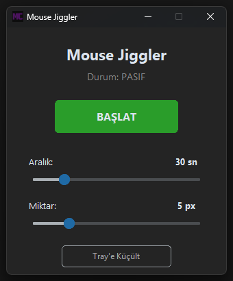

# 🖱️ Mouse Jiggler

A lightweight Windows desktop application that prevents screen lock and idle timeouts by automatically moving the mouse at configurable intervals.

## Features

- **Start / Stop** control with a single button
- **Interval setting** — choose how often the mouse moves (10–120 seconds)
- **Movement amount** — configure how many pixels the mouse shifts (1–20 px)
- **System tray support** — minimize to tray, double-click to restore
- **Custom icon** — clean and minimal UI with dark mode

## Screenshots

> 

## Tech Stack

- **Python 3.14**
- **customtkinter** — modern dark-mode UI
- **pyautogui** — mouse control
- **pystray** — system tray integration
- **Pillow** — icon handling
- **PyInstaller** — packaged as a standalone `.exe`

## Installation

### Run from source

```bash
pip install -r requirements.txt
python main.py
```

### Build executable

```bash
build.bat
```

The output will be at `dist/MouseJiggler.exe` — no Python installation required.

## Use Cases

- Prevent screen lock during long meetings or presentations
- Keep remote desktop sessions alive
- Avoid idle timeouts in corporate environments

## License

MIT
